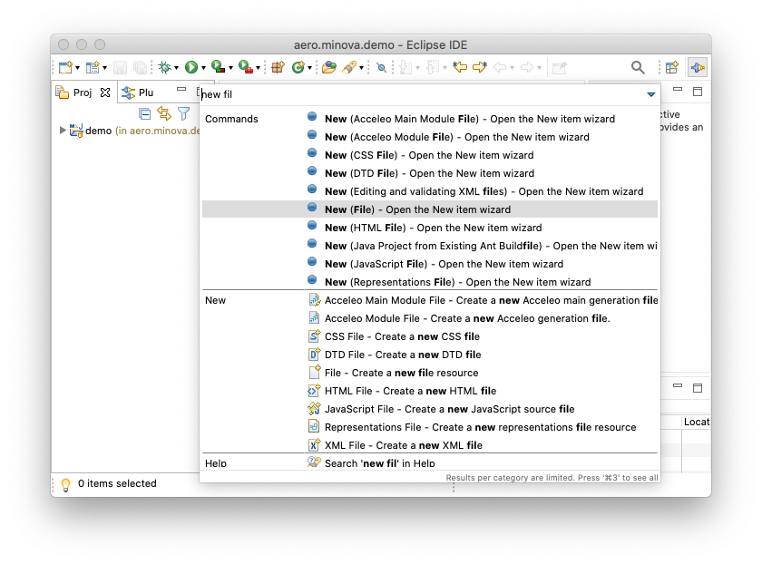
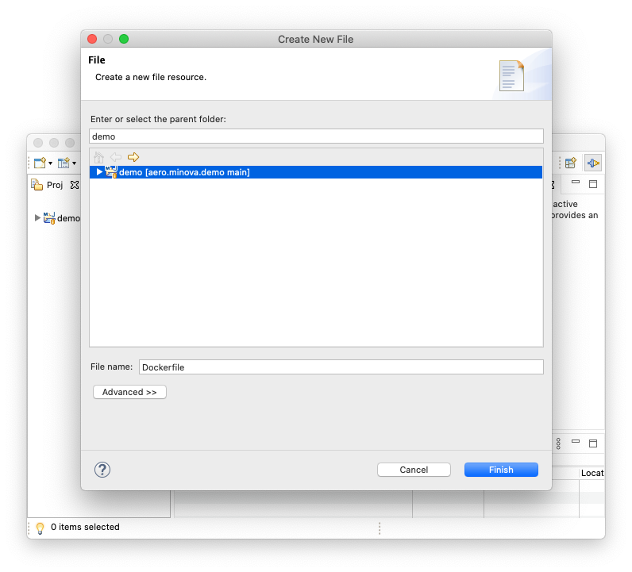

= aero.minova.demo

Demo project for Spring Boot and Docker

In diesem Projekt versuchen wir einen einfache Spring Boot Anwendung zu erstellen.
Diese wollen wir dann auf GitHub speichern und dort bauen lassen.
Danach soll sie als Docker Container / Docker Image nach Docker Hub exportiert werden.

Als letztes wollen wir sie dann auf einem QNAP NAS installieren.
Dort soll auch ein Update der Anwendung durchgeführt werden.

== GitHub Projekt anlegen

Als Erstes legen wir uns ein Projekt in GitHub an.
Dazu verwenden wir die Web-Oberfläche von GitHub.

image::doc/images/github-create-project.png[]

* Unser Repository nennen wir `aero.minova.demo`.
Als Beschreibung verwenden wir `Demo project for Spring Boot and Docker`.

* Das Projekt ist öffentlich.

* Wir erstellen eine README.md Datei, die wir später in .adoc umbennenen.

* Da es ein Java-Projekt wird, möchten wir auch eine entsprechende `.gitignore` Datei anlegen.

* Als Lizenz verwenden wir mal die EPL 2.0.

Danach laden wir das Projekt lokal herunter.
Dazu kopieren wir den Link von der Projektseite.

image::doc/images/github-copy-link.png[]

Im Terminal wechseln wir in das Verzeichnis, in dem wir das Repository anlegen wollen.
Danach rufen wir den Befehl zum clonen auf.

----
$ cd ~/git
$ git clone https://github.com/minova-afis/aero.minova.demo.git
Cloning into 'aero.minova.demo'...
remote: Enumerating objects: 5, done.
remote: Counting objects: 100% (5/5), done.
remote: Compressing objects: 100% (5/5), done.
remote: Total 5 (delta 0), reused 0 (delta 0), pack-reused 0
Unpacking objects: 100% (5/5), done.
----

Dann wechseln wir noch in das Stammverzeichnis des Projektes.

----
$ cd aero.minova.demo 
$ ls
total 48
drwxr-xr-x   6 saak  staff    192 19 Feb 20:17 .
drwxr-xr-x  70 saak  staff   2240 19 Feb 20:17 ..
drwxr-xr-x  13 saak  staff    416 19 Feb 20:17 .git
-rw-r--r--   1 saak  staff    278 19 Feb 20:17 .gitignore
-rw-r--r--   1 saak  staff  14197 19 Feb 20:17 LICENSE
-rw-r--r--   1 saak  staff     59 19 Feb 20:17 README.md
----

Jetzt benennen wir unsere README.md Datei um und checken die Änderung ein.

----
$ mv README.md README.adoc
$ git add .
$ git status
On branch main
Your branch is up to date with 'origin/main'.

Changes to be committed:
  (use "git reset HEAD <file>..." to unstage)

	renamed:    README.md -> README.adoc

$ git commit -m "README im adoc Format speichern"
[main cbca220] README im adoc Format speichern
 1 file changed, 0 insertions(+), 0 deletions(-)
 rename README.md => README.adoc (100%)
----

== Spring Boot Projekt anlegen

Für dieses Beispiel legen wir mit link:https://start.spring.io[Spring Initializr] ein neues Projekt an.

image::doc/images/spring-initializr.png[]

* Wir wollen ein Maven Projekt erstellen.
* Wir wollen in Java Version 11 programmieren.
* Wir verwenden das aktuellste stabile Release von Spring Boot.
* Als Namen verwenden wir `aero.minova.demo`.

Nachdem das Projekt erstellt wurde, laden wir es automatisch herunter.
Das ZIP-File entpacken wir und kopieren das Ergebnis in das neue Projekt.

----
$ git status                                     
On branch main
Your branch is ahead of 'origin/main' by 1 commit.
  (use "git push" to publish your local commits)

Untracked files:
  (use "git add <file>..." to include in what will be committed)

	HELP.md
	mvnw
	mvnw.cmd
	pom.xml
	src/

nothing added to commit but untracked files present (use "git add" to track)
$ git add .
$ git commit -m "Spring Boot Projekt importieren"
[main 6b97a11] Spring Boot Projekt importieren
 7 files changed, 569 insertions(+)
 create mode 100644 HELP.md
 create mode 100755 mvnw
 create mode 100644 mvnw.cmd
 create mode 100644 pom.xml
 create mode 100644 src/main/java/aero/minova/demo/DemoApplication.java
 create mode 100644 src/main/resources/application.properties
 create mode 100644 src/test/java/aero/minova/demo/DemoApplicationTests.java
$ git push
----

Wir können die neuen Dateien mit `git status` anzeigen lassen.
Danach fürgen wir sie dem Projekt hinzu.
Am Ende können wir alles hochladen.

== Projekt in Eclipse importieren

Jetzt können wir das Projekt in Eclipse importieren.
Dazu öffnen wir Eclipse und importieren ein Maven-Projekt.

image::doc/images/eclipse-import-maven.png[]

Mit "Import projects..." -> "Existing Maven Projects" öffnen wir das Fenster zum Auswählen eines Verzeichnisses, in dem nach den neuen Projekten gesucht werden soll.

image::doc/images/eclipse-select-import-folder.png[]

Wir wählen das Root-Verzeichnis des Projektes aus und selektieren das Projekt.
Mit Klick auf Finish wird das Projekt importiert.
Bei neuen Projekten werden durch Eclipse noch einige Dateien angelegt.
Wir wollen nur die Datei .project in GitHub speichern.
Aus diesem Grund müssen wir noch die Datei .gitignore ergänzen.

----

# eclipse Settings
.settings
.classpath
----

Diese Dateien wollen wir nicht in GitHub speichern.

----
$ git status
On branch main
Your branch is ahead of 'origin/main' by 2 commits.
  (use "git push" to publish your local commits)

Changes not staged for commit:
  (use "git add <file>..." to update what will be committed)
  (use "git checkout -- <file>..." to discard changes in working directory)

	modified:   .gitignore

Untracked files:
  (use "git add <file>..." to include in what will be committed)

	.project
	
$ git add .
----

Für fügen die geänderten Dateien hinzu.
Jetzt können wir das Projekt in Eclipse verwenden.

=== RestController erstellen

Wir wollen die Anwendung auf eine HTTP-Anfrage reagieren lassen.
Dazu benötigen wir einen `@RestController`.

Im link:pom.xml[`pom.xml`] müssen wir die Abhängigkeit einfügen.

[source,xml]
----
        <dependency>
            <groupId>org.springframework.boot</groupId>
            <artifactId>spring-boot-starter-web</artifactId>
        </dependency>
----

Jetzt können wir die Klasse link:src/main/java/aero/minova/demo/controller/MyController.java[`MyController`] erstellen.
Die Klasse ist als `@RestController` definiert und hat eine Methode für das Get-Mapping.

[source,java]
----
@RestController
public class MyController {
    @GetMapping(value = "/")
    public String getRoot() {
        return "Hello World";
    }
}
----

Wenn wir die Anwendung starten, können wir auf localhost Port 8080 das Ergebnis sehen.

image::doc/images/localhost-8080.png[]

Als Antwort erhalten wir Hello World im Browser angezeigt.

== Docker Image erstellen

=== Dockerfile anlegen

Als nächsten Schritt erstellen wir ein Dockerfile. 
Es dient dazu, aus der Spring Boot Anwendung ein Docker Image zu erstellen.

Im Project Explorer wählen wir unser Projekt aus.
Mit Ctrl+3 (Cmd+3) können wir eine neue Datei anlegen.
Wir schreiben `new file` und wählen den Eintrag `New (File) - Open the New item wizard`.

Als `File name:` geben wir Dockerfile an und klicken auf Finish.
Unter Umständen wird dann ein Editor gesucht. 
Eclipse hat einen Editor für Dockerfiles im Angebot; den kann man gerne installieren.

In das link:Dockerfile[Dockerfile] schreiben wir den folgenden Inhalt.

----
FROM openjdk:11-jdk-oraclelinux7 <1>
ARG JAR_FILE=target/*.jar <2>
COPY ${JAR_FILE} app.jar
ENTRYPOINT [ "java", "-jar", "/app.jar" ]
----
 
<1> Wir verwenden Java 11. 
Es gibt eine Version, die im Container funktionieren sollte.

<2> Wenn wir später beim Erstellen eine Fehlermeldung erhalten, die besagt, dass es keine jar - Datei gibt, dann müssen wir zuerst noch einmal mit Maven das Projekt bauen (`mvn clean verify`).

=== Projekt bauen

Damit das Docker Image erstellt werden kann, muss zuerst das Spring Boot Projekt erstellt werden. 
Auf der Kommandozeile gelingt dies durch folgenden Befehl.

----
$ mvn clean verify
[INFO] Scanning for projects...
[INFO] 
[INFO] --------------------------< aero.minova:demo >--------------------------
[INFO] Building demo 0.0.1-SNAPSHOT
[INFO] --------------------------------[ jar ]---------------------------------
[INFO] 
[INFO] --- maven-clean-plugin:3.1.0:clean (default-clean) @ demo ---
[INFO] Deleting /Users/saak/git/aero.minova.demo/target
[INFO] 
[INFO] --- maven-resources-plugin:3.2.0:resources (default-resources) @ demo ---
[INFO] Using 'UTF-8' encoding to copy filtered resources.
[INFO] Using 'UTF-8' encoding to copy filtered properties files.
[INFO] Copying 1 resource
[INFO] Copying 0 resource
[INFO] 
[INFO] --- maven-compiler-plugin:3.8.1:compile (default-compile) @ demo ---
[INFO] Changes detected - recompiling the module!
[INFO] Compiling 2 source files to /Users/saak/git/aero.minova.demo/target/classes
[INFO] 
[INFO] --- maven-resources-plugin:3.2.0:testResources (default-testResources) @ demo ---
[INFO] Using 'UTF-8' encoding to copy filtered resources.
[INFO] Using 'UTF-8' encoding to copy filtered properties files.
[INFO] skip non existing resourceDirectory /Users/saak/git/aero.minova.demo/src/test/resources
[INFO] 
[INFO] --- maven-compiler-plugin:3.8.1:testCompile (default-testCompile) @ demo ---
[INFO] Changes detected - recompiling the module!
[INFO] Compiling 1 source file to /Users/saak/git/aero.minova.demo/target/test-classes
[INFO] 
[INFO] --- maven-surefire-plugin:2.22.2:test (default-test) @ demo ---
[INFO] 
[INFO] -------------------------------------------------------
[INFO]  T E S T S
[INFO] -------------------------------------------------------
[INFO] Running aero.minova.demo.DemoApplicationTests
10:04:56.632 [main] DEBUG org.springframework.test.context.BootstrapUtils - Instantiating CacheAwareContextLoaderDelegate from class [org.springframework.test.context.cache.DefaultCacheAwareContextLoaderDelegate]
10:04:56.640 [main] DEBUG org.springframework.test.context.BootstrapUtils - Instantiating BootstrapContext using constructor [public org.springframework.test.context.support.DefaultBootstrapContext(java.lang.Class,org.springframework.test.context.CacheAwareContextLoaderDelegate)]
10:04:56.665 [main] DEBUG org.springframework.test.context.BootstrapUtils - Instantiating TestContextBootstrapper for test class [aero.minova.demo.DemoApplicationTests] from class [org.springframework.boot.test.context.SpringBootTestContextBootstrapper]
10:04:56.673 [main] INFO org.springframework.boot.test.context.SpringBootTestContextBootstrapper - Neither @ContextConfiguration nor @ContextHierarchy found for test class [aero.minova.demo.DemoApplicationTests], using SpringBootContextLoader
10:04:56.676 [main] DEBUG org.springframework.test.context.support.AbstractContextLoader - Did not detect default resource location for test class [aero.minova.demo.DemoApplicationTests]: class path resource [aero/minova/demo/DemoApplicationTests-context.xml] does not exist
10:04:56.677 [main] DEBUG org.springframework.test.context.support.AbstractContextLoader - Did not detect default resource location for test class [aero.minova.demo.DemoApplicationTests]: class path resource [aero/minova/demo/DemoApplicationTestsContext.groovy] does not exist
10:04:56.677 [main] INFO org.springframework.test.context.support.AbstractContextLoader - Could not detect default resource locations for test class [aero.minova.demo.DemoApplicationTests]: no resource found for suffixes {-context.xml, Context.groovy}.
10:04:56.677 [main] INFO org.springframework.test.context.support.AnnotationConfigContextLoaderUtils - Could not detect default configuration classes for test class [aero.minova.demo.DemoApplicationTests]: DemoApplicationTests does not declare any static, non-private, non-final, nested classes annotated with @Configuration.
10:04:56.707 [main] DEBUG org.springframework.test.context.support.ActiveProfilesUtils - Could not find an 'annotation declaring class' for annotation type [org.springframework.test.context.ActiveProfiles] and class [aero.minova.demo.DemoApplicationTests]
10:04:56.750 [main] DEBUG org.springframework.context.annotation.ClassPathScanningCandidateComponentProvider - Identified candidate component class: file [/Users/saak/git/aero.minova.demo/target/classes/aero/minova/demo/DemoApplication.class]
10:04:56.750 [main] INFO org.springframework.boot.test.context.SpringBootTestContextBootstrapper - Found @SpringBootConfiguration aero.minova.demo.DemoApplication for test class aero.minova.demo.DemoApplicationTests
10:04:56.820 [main] DEBUG org.springframework.boot.test.context.SpringBootTestContextBootstrapper - @TestExecutionListeners is not present for class [aero.minova.demo.DemoApplicationTests]: using defaults.
10:04:56.821 [main] INFO org.springframework.boot.test.context.SpringBootTestContextBootstrapper - Loaded default TestExecutionListener class names from location [META-INF/spring.factories]: [org.springframework.boot.test.mock.mockito.MockitoTestExecutionListener, org.springframework.boot.test.mock.mockito.ResetMocksTestExecutionListener, org.springframework.boot.test.autoconfigure.restdocs.RestDocsTestExecutionListener, org.springframework.boot.test.autoconfigure.web.client.MockRestServiceServerResetTestExecutionListener, org.springframework.boot.test.autoconfigure.web.servlet.MockMvcPrintOnlyOnFailureTestExecutionListener, org.springframework.boot.test.autoconfigure.web.servlet.WebDriverTestExecutionListener, org.springframework.boot.test.autoconfigure.webservices.client.MockWebServiceServerTestExecutionListener, org.springframework.test.context.web.ServletTestExecutionListener, org.springframework.test.context.support.DirtiesContextBeforeModesTestExecutionListener, org.springframework.test.context.event.ApplicationEventsTestExecutionListener, org.springframework.test.context.support.DependencyInjectionTestExecutionListener, org.springframework.test.context.support.DirtiesContextTestExecutionListener, org.springframework.test.context.transaction.TransactionalTestExecutionListener, org.springframework.test.context.jdbc.SqlScriptsTestExecutionListener, org.springframework.test.context.event.EventPublishingTestExecutionListener]
10:04:56.831 [main] DEBUG org.springframework.boot.test.context.SpringBootTestContextBootstrapper - Skipping candidate TestExecutionListener [org.springframework.test.context.transaction.TransactionalTestExecutionListener] due to a missing dependency. Specify custom listener classes or make the default listener classes and their required dependencies available. Offending class: [org/springframework/transaction/interceptor/TransactionAttributeSource]
10:04:56.831 [main] DEBUG org.springframework.boot.test.context.SpringBootTestContextBootstrapper - Skipping candidate TestExecutionListener [org.springframework.test.context.jdbc.SqlScriptsTestExecutionListener] due to a missing dependency. Specify custom listener classes or make the default listener classes and their required dependencies available. Offending class: [org/springframework/transaction/interceptor/TransactionAttribute]
10:04:56.831 [main] INFO org.springframework.boot.test.context.SpringBootTestContextBootstrapper - Using TestExecutionListeners: [org.springframework.test.context.web.ServletTestExecutionListener@c5dc4a2, org.springframework.test.context.support.DirtiesContextBeforeModesTestExecutionListener@4a194c39, org.springframework.test.context.event.ApplicationEventsTestExecutionListener@52066604, org.springframework.boot.test.mock.mockito.MockitoTestExecutionListener@340b9973, org.springframework.boot.test.autoconfigure.SpringBootDependencyInjectionTestExecutionListener@56113384, org.springframework.test.context.support.DirtiesContextTestExecutionListener@5669c5fb, org.springframework.test.context.event.EventPublishingTestExecutionListener@373ebf74, org.springframework.boot.test.mock.mockito.ResetMocksTestExecutionListener@5f9678e1, org.springframework.boot.test.autoconfigure.restdocs.RestDocsTestExecutionListener@c4ed84, org.springframework.boot.test.autoconfigure.web.client.MockRestServiceServerResetTestExecutionListener@189aa67a, org.springframework.boot.test.autoconfigure.web.servlet.MockMvcPrintOnlyOnFailureTestExecutionListener@5a9d6f02, org.springframework.boot.test.autoconfigure.web.servlet.WebDriverTestExecutionListener@362045c0, org.springframework.boot.test.autoconfigure.webservices.client.MockWebServiceServerTestExecutionListener@112f364d]
10:04:56.834 [main] DEBUG org.springframework.test.context.support.AbstractDirtiesContextTestExecutionListener - Before test class: context [DefaultTestContext@41dd05a testClass = DemoApplicationTests, testInstance = [null], testMethod = [null], testException = [null], mergedContextConfiguration = [WebMergedContextConfiguration@613a8ee1 testClass = DemoApplicationTests, locations = '{}', classes = '{class aero.minova.demo.DemoApplication}', contextInitializerClasses = '[]', activeProfiles = '{}', propertySourceLocations = '{}', propertySourceProperties = '{org.springframework.boot.test.context.SpringBootTestContextBootstrapper=true}', contextCustomizers = set[org.springframework.boot.test.context.filter.ExcludeFilterContextCustomizer@5dafbe45, org.springframework.boot.test.json.DuplicateJsonObjectContextCustomizerFactory$DuplicateJsonObjectContextCustomizer@2f953efd, org.springframework.boot.test.mock.mockito.MockitoContextCustomizer@0, org.springframework.boot.test.web.client.TestRestTemplateContextCustomizer@6e2aa843, org.springframework.boot.test.autoconfigure.actuate.metrics.MetricsExportContextCustomizerFactory$DisableMetricExportContextCustomizer@7dc3712, org.springframework.boot.test.autoconfigure.properties.PropertyMappingContextCustomizer@0, org.springframework.boot.test.autoconfigure.web.servlet.WebDriverContextCustomizerFactory$Customizer@769a1df5, org.springframework.boot.test.context.SpringBootTestArgs@1, org.springframework.boot.test.context.SpringBootTestWebEnvironment@78e94dcf], resourceBasePath = 'src/main/webapp', contextLoader = 'org.springframework.boot.test.context.SpringBootContextLoader', parent = [null]], attributes = map['org.springframework.test.context.web.ServletTestExecutionListener.activateListener' -> true]], class annotated with @DirtiesContext [false] with mode [null].
10:04:56.861 [main] DEBUG org.springframework.test.context.support.TestPropertySourceUtils - Adding inlined properties to environment: {spring.jmx.enabled=false, org.springframework.boot.test.context.SpringBootTestContextBootstrapper=true}

  .   ____          _            __ _ _
 /\\ / ___'_ __ _ _(_)_ __  __ _ \ \ \ \
( ( )\___ | '_ | '_| | '_ \/ _` | \ \ \ \
 \\/  ___)| |_)| | | | | || (_| |  ) ) ) )
  '  |____| .__|_| |_|_| |_\__, | / / / /
 =========|_|==============|___/=/_/_/_/
 :: Spring Boot ::                (v2.4.3)

2021-02-20 10:04:57.386  INFO 71149 --- [           main] aero.minova.demo.DemoApplicationTests    : Starting DemoApplicationTests using Java 11.0.7 on sawmbptb.local with PID 71149 (started by saak in /Users/saak/git/aero.minova.demo)
2021-02-20 10:04:57.389  INFO 71149 --- [           main] aero.minova.demo.DemoApplicationTests    : No active profile set, falling back to default profiles: default
2021-02-20 10:04:58.280  INFO 71149 --- [           main] o.s.s.concurrent.ThreadPoolTaskExecutor  : Initializing ExecutorService 'applicationTaskExecutor'
2021-02-20 10:04:58.548  INFO 71149 --- [           main] aero.minova.demo.DemoApplicationTests    : Started DemoApplicationTests in 1.681 seconds (JVM running for 2.43)
[INFO] Tests run: 1, Failures: 0, Errors: 0, Skipped: 0, Time elapsed: 2.239 s - in aero.minova.demo.DemoApplicationTests
2021-02-20 10:04:58.821  INFO 71149 --- [extShutdownHook] o.s.s.concurrent.ThreadPoolTaskExecutor  : Shutting down ExecutorService 'applicationTaskExecutor'
[INFO] 
[INFO] Results:
[INFO] 
[INFO] Tests run: 1, Failures: 0, Errors: 0, Skipped: 0
[INFO] 
[INFO] 
[INFO] --- maven-jar-plugin:3.2.0:jar (default-jar) @ demo ---
[INFO] Building jar: /Users/saak/git/aero.minova.demo/target/demo-0.0.1-SNAPSHOT.jar
[INFO] 
[INFO] --- spring-boot-maven-plugin:2.4.3:repackage (repackage) @ demo ---
[INFO] Replacing main artifact with repackaged archive
[INFO] ------------------------------------------------------------------------
[INFO] BUILD SUCCESS
[INFO] ------------------------------------------------------------------------
[INFO] Total time:  5.579 s
[INFO] Finished at: 2021-02-20T10:04:59+01:00
[INFO] ------------------------------------------------------------------------
$ ls target
total 33312
drwxr-xr-x  11 saak  staff       352 20 Feb 10:04 .
drwxr-xr-x  17 saak  staff       544 20 Feb 10:04 ..
drwxr-xr-x   4 saak  staff       128 20 Feb 10:04 classes
-rw-r--r--   1 saak  staff  17048671 20 Feb 10:04 demo-0.0.1-SNAPSHOT.jar
-rw-r--r--   1 saak  staff      3279 20 Feb 10:04 demo-0.0.1-SNAPSHOT.jar.original
drwxr-xr-x   3 saak  staff        96 20 Feb 10:04 generated-sources
drwxr-xr-x   3 saak  staff        96 20 Feb 10:04 generated-test-sources
drwxr-xr-x   3 saak  staff        96 20 Feb 10:04 maven-archiver
drwxr-xr-x   3 saak  staff        96 20 Feb 10:04 maven-status
drwxr-xr-x   4 saak  staff       128 20 Feb 10:04 surefire-reports
drwxr-xr-x   3 saak  staff        96 20 Feb 10:04 test-classes
----

Wenn der Build-Prozess erfolgreich war, gibt es auch im target - Ordner ein jar - File.

=== Docker Image erstellen

Jetzt können wir in der Kommandozeile auch das Docker Image erstellen.

----
$ docker build -t minova/demo . <1>
Sending build context to Docker daemon  26.69MB
Step 1/4 : FROM openjdk:11-jdk-oraclelinux7
 ---> 3a48ae2e0973
Step 2/4 : ARG JAR_FILE=target/*.jar
 ---> Using cache
 ---> 0524bba43129
Step 3/4 : COPY ${JAR_FILE} app.jar
 ---> Using cache
 ---> e3e64eb4dfa0
Step 4/4 : ENTRYPOINT [ "java", "-jar", "/app.jar" ]
 ---> Using cache
 ---> c35a42e10973
Successfully built c35a42e10973
Successfully tagged minova/demo:latest
----

<1> Die Option `-t` legt das Tag fest. 
Am Anfang steht der Benutzername von Dockerhub (`minova`).
Danach kann ein freier Name gewählt werden (`demo`).

