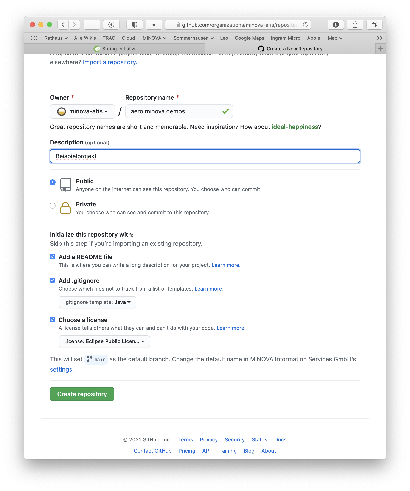
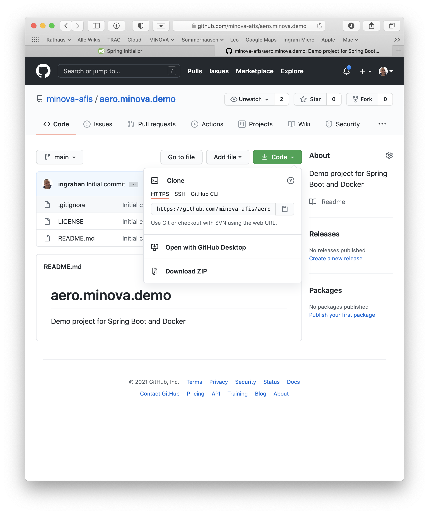
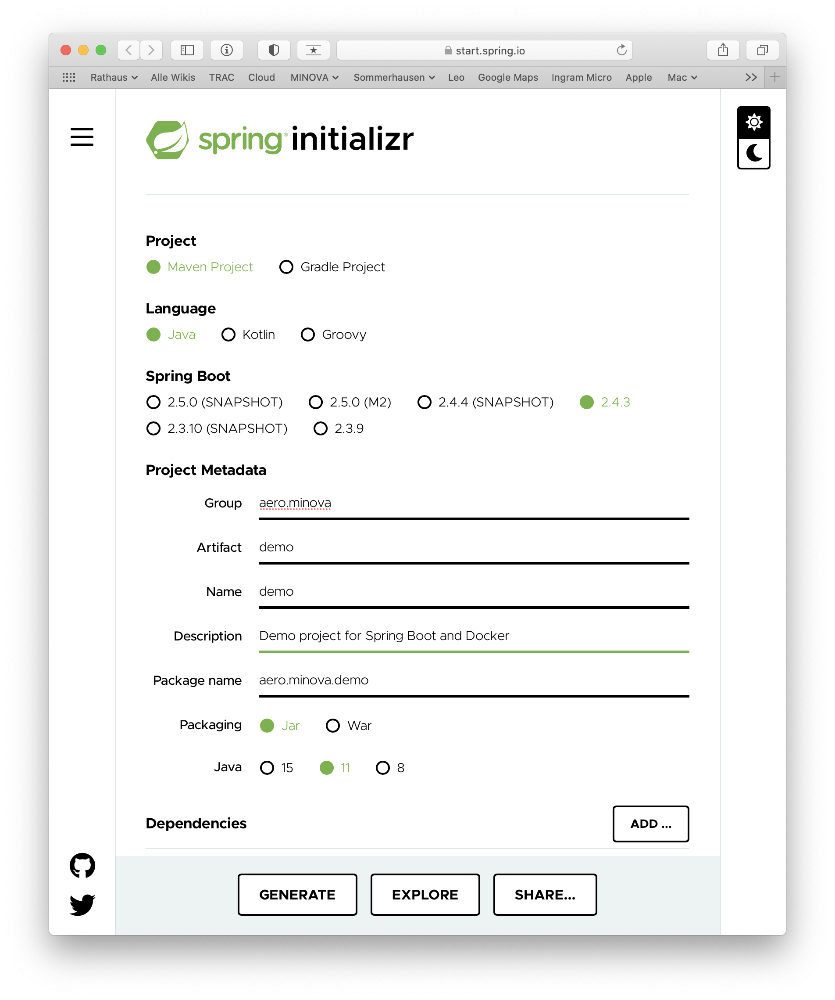
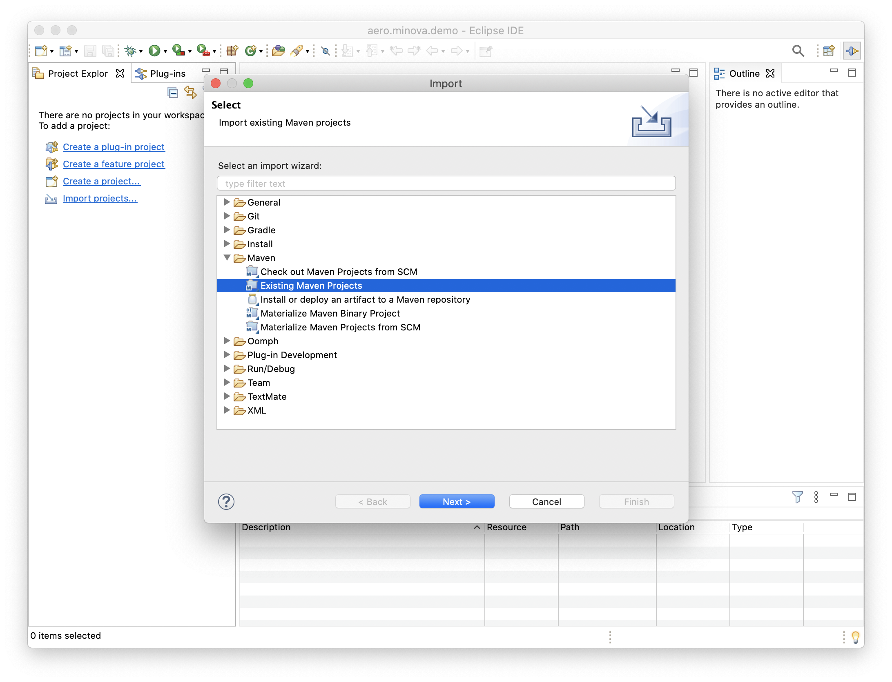
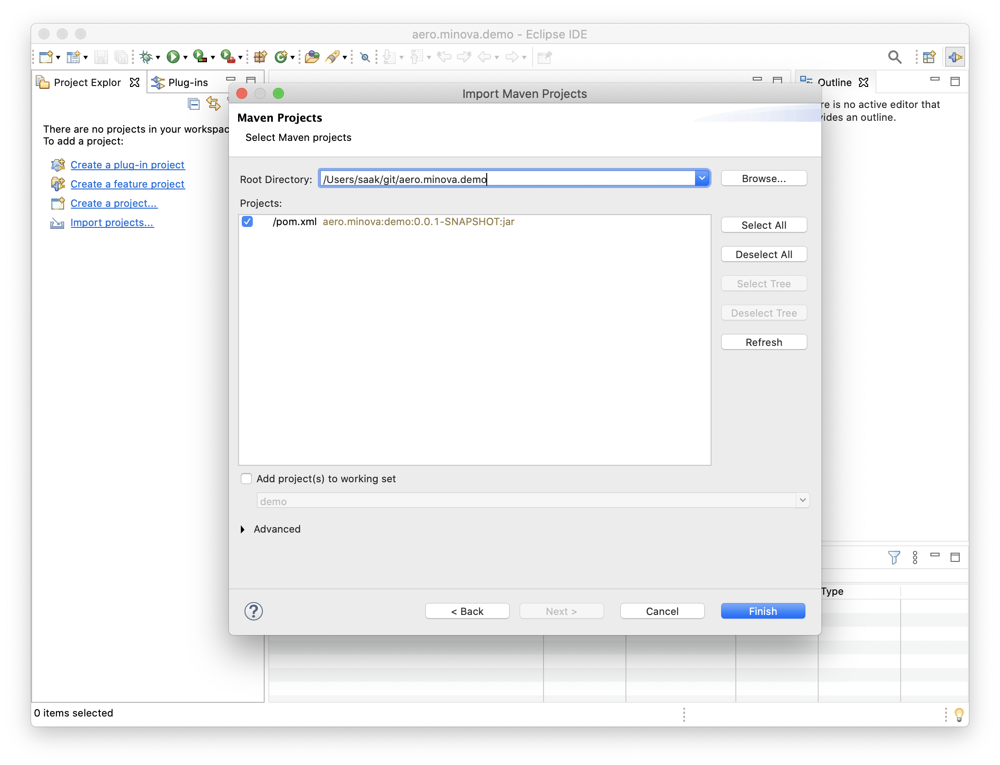
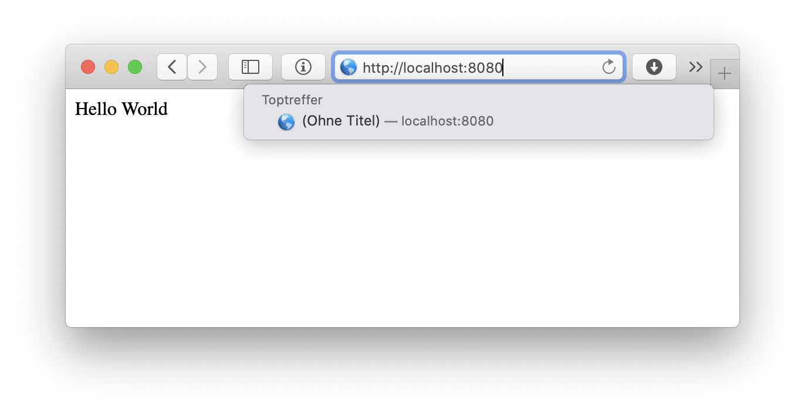

= aero.minova.demo

Demo project for Spring Boot and Docker

In diesem Projekt versuchen wir einen einfache Spring Boot Anwendung zu erstellen.
Diese wollen wir dann auf GitHub speichern und dort bauen lassen.
Danach soll sie als Docker Container / Docker Image nach Docker Hub exportiert werden.

Als letztes wollen wir sie dann auf einem QNAP NAS installieren.
Dort soll auch ein Update der Anwendung durchgeführt werden.

== GitHub Projekt anlegen

Als Erstes legen wir uns ein Projekt in GitHub an.
Dazu verwenden wir die Web-Oberfläche von GitHub.

* Unser Repository nennen wir `aero.minova.demo`.
Als Beschreibung verwenden wir `Demo project for Spring Boot and Docker`.

* Das Projekt ist öffentlich.

* Wir erstellen eine README.md Datei, die wir später in .adoc umbennenen.

* Da es ein Java-Projekt wird, möchten wir auch eine entsprechende `.gitignore` Datei anlegen.

* Als Lizenz verwenden wir mal die EPL 2.0.

Danach laden wir das Projekt lokal herunter.
Dazu kopieren wir den Link von der Projektseite.

Im Terminal wechseln wir in das Verzeichnis, in dem wir das Repository anlegen wollen.
Danach rufen wir den Befehl zum clonen auf.

----
$ cd ~/git
$ git clone https://github.com/minova-afis/aero.minova.demo.git
Cloning into 'aero.minova.demo'...
remote: Enumerating objects: 5, done.
remote: Counting objects: 100% (5/5), done.
remote: Compressing objects: 100% (5/5), done.
remote: Total 5 (delta 0), reused 0 (delta 0), pack-reused 0
Unpacking objects: 100% (5/5), done.
----

Dann wechseln wir noch in das Stammverzeichnis des Projektes.

----
$ cd aero.minova.demo 
$ ls
total 48
drwxr-xr-x   6 saak  staff    192 19 Feb 20:17 .
drwxr-xr-x  70 saak  staff   2240 19 Feb 20:17 ..
drwxr-xr-x  13 saak  staff    416 19 Feb 20:17 .git
-rw-r--r--   1 saak  staff    278 19 Feb 20:17 .gitignore
-rw-r--r--   1 saak  staff  14197 19 Feb 20:17 LICENSE
-rw-r--r--   1 saak  staff     59 19 Feb 20:17 README.md
----

Jetzt benennen wir unsere README.md Datei um und checken die Änderung ein.

----
$ mv README.md README.adoc
$ git add .
$ git status
On branch main
Your branch is up to date with 'origin/main'.

Changes to be committed:
  (use "git reset HEAD <file>..." to unstage)

	renamed:    README.md -> README.adoc

$ git commit -m "README im adoc Format speichern"
[main cbca220] README im adoc Format speichern
 1 file changed, 0 insertions(+), 0 deletions(-)
 rename README.md => README.adoc (100%)
----

== Spring Boot Projekt anlegen

Für dieses Beispiel legen wir mit link:https://start.spring.io[Spring Initializr] ein neues Projekt an.

* Wir wollen ein Maven Projekt erstellen.
* Wir wollen in Java Version 11 programmieren.
* Wir verwenden das aktuellste stabile Release von Spring Boot.
* Als Namen verwenden wir `aero.minova.demo`.

Nachdem das Projekt erstellt wurde, laden wir es automatisch herunter.
Das ZIP-File entpacken wir und kopieren das Ergebnis in das neue Projekt.

----
$ git status                                     
On branch main
Your branch is ahead of 'origin/main' by 1 commit.
  (use "git push" to publish your local commits)

Untracked files:
  (use "git add <file>..." to include in what will be committed)

	HELP.md
	mvnw
	mvnw.cmd
	pom.xml
	src/

nothing added to commit but untracked files present (use "git add" to track)
$ git add .
$ git commit -m "Spring Boot Projekt importieren"
[main 6b97a11] Spring Boot Projekt importieren
 7 files changed, 569 insertions(+)
 create mode 100644 HELP.md
 create mode 100755 mvnw
 create mode 100644 mvnw.cmd
 create mode 100644 pom.xml
 create mode 100644 src/main/java/aero/minova/demo/DemoApplication.java
 create mode 100644 src/main/resources/application.properties
 create mode 100644 src/test/java/aero/minova/demo/DemoApplicationTests.java
$ git push
----

Wir können die neuen Dateien mit `git status` anzeigen lassen.
Danach fürgen wir sie dem Projekt hinzu.
Am Ende können wir alles hochladen.

== Projekt in Eclipse importieren

Jetzt können wir das Projekt in Eclipse importieren.
Dazu öffnen wir Eclipse und importieren ein Maven-Projekt.

Mit "Import projects..." -> "Existing Maven Projects" öffnen wir das Fenster zum Auswählen eines Verzeichnisses, in dem nach den neuen Projekten gesucht werden soll.

Wir wählen das Root-Verzeichnis des Projektes aus und selektieren das Projekt.
Mit Klick auf Finish wird das Projekt importiert.
Bei neuen Projekten werden durch Eclipse noch einige Dateien angelegt.
Wir wollen nur die Datei .project in GitHub speichern.
Aus diesem Grund müssen wir noch die Datei .gitignore ergänzen.

----

# eclipse Settings
.settings
.classpath
----

Diese Dateien wollen wir nicht in GitHub speichern.

----
$ git status
On branch main
Your branch is ahead of 'origin/main' by 2 commits.
  (use "git push" to publish your local commits)

Changes not staged for commit:
  (use "git add <file>..." to update what will be committed)
  (use "git checkout -- <file>..." to discard changes in working directory)

	modified:   .gitignore

Untracked files:
  (use "git add <file>..." to include in what will be committed)

	.project
	
$ git add .
----

Für fügen die geänderten Dateien hinzu.
Jetzt können wir das Projekt in Eclipse verwenden.

=== RestController erstellen

Wir wollen die Anwendung auf eine HTTP-Anfrage reagieren lassen.
Dazu benötigen wir einen `@RestController`.

Im link:pom.xml[`pom.xml`] müssen wir die Abhängigkeit einfügen.

[source,xml]
----
        <dependency>
            <groupId>org.springframework.boot</groupId>
            <artifactId>spring-boot-starter-web</artifactId>
        </dependency>
----

Jetzt können wir die Klasse link:src/main/java/aero/minova/demo/controller/MyController.java[`MyController`] erstellen.
Die Klasse ist als `@RestController` definiert und hat eine Methode für das Get-Mapping.

[source,java]
----
@RestController
public class MyController {
    @GetMapping(value = "/")
    public String getRoot() {
        return "Hello World";
    }
}
----

Wenn wir die Anwendung starten, können wir auf localhost Port 8080 das Ergebnis sehen.

Als Antwort erhalten wir Hello World im Browser angezeigt.